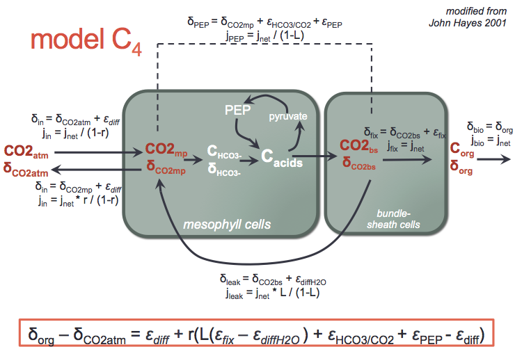

```{r "load packages", include=FALSE}
library(tidyverse)
knitr::opts_chunk$set(eval = FALSE)
```

# C3

```{r out.width = "100%", echo=FALSE, eval=TRUE}
 
```


```{r eval=TRUE}
# fractionation factors (assumed constant)
eps_diff_air <- -4.4
eps_fix <- -25

# C3 plant
C3 <- 
  data_frame(
    r = seq(0, 1, by = 0.1),
    eps_org_vs_atm = eps_diff_air + r * (eps_fix - eps_diff_air)
  )
C3
```

```{r eval=TRUE}
# define base plot
base_plot <- ggplot() + 
  aes(x = r, y = eps_org_vs_atm) +
  geom_line() + 
  scale_y_reverse(name = latex2exp::TeX("$\\epsilon_{org/atm}$"), breaks = seq(-40, +40, by = 2))  +
  scale_x_continuous(name = "reversibility", labels = function(x) paste(100*x, "%"), expand = c(0,0)) +
  theme_gray()
  
# now put the C3 data set into the base plot (%+% operator)
base_plot %+% C3
```

## Question

> How do you interpret this plot?

# C4

```{r out.width = "100%", echo=FALSE, eval=TRUE}
 
```

```{r eval=TRUE}
# fractionation factors (assumed constant)
eps_HCO3_CO2 <- 7.9
eps_PEP <- -2.2
eps_diff_water <- -0.8

# C4 plant
C4 <- 
  data_frame( 
    r = seq(0, 1, by = 0.1),
    L = c(0), #assume the plant is perfectly not leaky
    eps_org_vs_atm = eps_diff_air + r * ( L * (eps_fix - eps_diff_water) + eps_HCO3_CO2 + eps_PEP - eps_diff_air)
  )

C4
```

```{r eval=TRUE}
# put C4 into the base plot
base_plot %+% C4 
```

## Question

> How do you interpret this plot?

# C4 continued: different values for L

```{r eval=TRUE}
C4 <- 
  # using expand.grid to make a combination of all r and L values
  expand.grid(
    r = seq(0, 1, by = 0.1),
    L = c(0, 0.27, 0.41, 1)
  ) %>% 
  as_data_frame() %>% 
  mutate(
    eps_org_vs_atm = eps_diff_air + r * ( L * (eps_fix - eps_diff_water) + eps_HCO3_CO2 + eps_PEP - eps_diff_air )
  )

C4
```

```{r eval=TRUE}
# now put C4 into the base plot, and add additional aesthetics (color for L)
base_plot %+% C4 %+% aes(color = factor(L)) +
  scale_color_manual(name = "leakage (L)", values = RColorBrewer::brewer.pal(8, "Dark2"), 
                     labels = function(x) paste(100*as.numeric(x), "%"))
```

## Question

> How do you interpret this plot?

# C3 vs C4

```{r eval=TRUE}
C3C4 <- bind_rows(
  C3 %>% mutate(pathway = "C3", L = "N/A"),
  C4 %>% mutate(pathway = "C4", L = factor(L))
)

C3C4

p <- base_plot %+% C3C4 %+% aes(color = factor(L), linetype = pathway) +
  scale_color_manual(name = "leakage (L)", values = RColorBrewer::brewer.pal(8, "Dark2"), 
                     labels = function(x) ifelse(x == "N/A", "not applicable", suppressWarnings(paste(100*as.numeric(x), "%"))))
p
```

## Question 1

> What are we seeing here? What are differences between C3 and C4 plants (how does L affect C4)?

## Question 2

> Farquhar et al., 1989 plotted a similar graph (reversibility vs. discrimination factor). Which is the C4 plant and how do you know? What is different about their graph, compared to ours?

```{r out.width = "100%", echo=FALSE, eval=TRUE}
 
```

## Question 3

When we measure plant isotopes we typically measure isotope ratios of plant biomass (Figure 1). 
```{r out.width = "100%", echo=FALSE, eval=TRUE}
# Figure 1. d13C distribution of C3 and C4 plants (from O'Leary, 1988
 
```

> The equations we've examined thus far are $\delta^{13}C_{org}$- $\delta^{13}C_{atm}$. But how does plant biomass get its $\delta^{13}C$ value? Assume atmospheric CO2 has an isotopic composition of -8‰, what do C3 and C4 plants look like?

```{r}
org <- C3C4 %>% 
  mutate(
    delta_biomass = ?
  )

p %+% org %+% aes(y = delta_biomass)
```

## Question 4

> How do these values compare to O'Leary's isotope calculations for C3 and C4 plants (Table 2)?

```{r out.width = "100%", echo=FALSE, eval=TRUE}
# Table 2 (from O'Leary, 1988
 
```

## Question 5 

Mook et al, 1974 - investigated the isotope fractionation between dissolved bicarbonate and gaseous and dissolved carbon dioxide. 

$$
\epsilon_{HCO_3/CO_2} = 9.483 × \frac{10^3}{T} + 23.89
$$

> Why would we care about this equilibrium fractionation (between CO2 and HCO3) when talking specifically about C4 plants?

```{r}
#' function to calculate the equilibrium fractionation between bicarbonate and CO2
#' @param temperature.C the temperature in degrees celsius
#' @return fractionation factor in permil
calc_eps_HCO3_CO2 <- function(temperature.C) {
  return(9.483 * 10^3/(temperature.C + 273.15) - 23.89)
}

# example caluation (at 25C)
calc_eps_HCO3_CO2(25)
```

## Question 6

> How does the isotope fractionation between bicarbonate and carbon dioxide affect the $\delta^{13}C$ value of C4 plants? 

## Question 7

> The equation above is calculated for 25ºC. What happens when we change the temperature? Plot the $\epsilon_{org/atm}$ for maize with a $\epsilon_{HCO_3/CO_2}$ at temperature range of (10 - 40ºC), a leakage factor of (L = 0.27), and reversibility range (r = 0 to 1).


```{r}
ex2 <-
  expand.grid(
    r = ???,
    L = ???,
    temp.C = ???
  ) %>% as_data_frame() %>% 
  # now do the calculations
  mutate(
    ???
  )

# now plot it
base_plot %+% ex2 %+%
  aes(color = factor(temp.C)) + 
  labs(title = "For corn (L=0.27)", color = "Temperature [C]")
```
